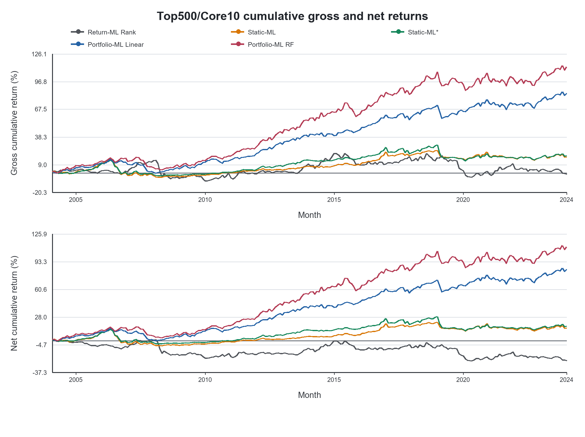

# Learning the Portfolio Objective: Machine Learning for Implementable U.S. Equity Portfolios

**MSc Mathematics and Finance, Imperial College London (2026)**  
**Yuxiang Jiang** · Supervisor: **Prof. Johannes Muhle-Karbe**

**Research question.** Can a machine-learning policy that optimises the portfolio objective directly create more implementable value than a policy that predicts stock returns first? The comparison accounts for covariance risk, inherited holdings, turnover, quadratic trading costs, and gradual portfolio adjustment.

**Central result (2005–2024, annualised utility):** Static-ML* **0.46%**; Linear Portfolio-ML **2.10%** (**+1.64 percentage points**); Random Features Portfolio-ML **2.36%** (**+1.90 percentage points**). These are the submitted thesis results, not newly generated estimates.

[Paper](paper/Jiang_2026_Learning_the_Portfolio_Objective.pdf) · [Code / Reproducibility](#reproducibility)



*Figure 4.1 in the submitted thesis: cumulative gross and net performance under the locked Top500/Core10 specification.*

## Empirical setting

The thesis studies a dynamically reconstituted U.S. Top-500 equity universe at monthly frequency. Source history begins in 1990, portfolio estimation begins in 1995, and the **formal cumulative out-of-sample evaluation runs from January 2005 through December 2024**. Models share the same implementation assumptions, factor-based risk inputs, transaction-cost model, and portfolio accounting. The baseline uses **USD 1 billion AUM** and risk aversion **γ = 10**. Earlier observations support construction and estimation; they are not part of the formal test period.

## Methods

| Method | Learning and portfolio decision |
| --- | --- |
| Return-ML Rank | Predict next-month stock returns, then rank securities into a long-short portfolio. |
| Static-ML | Use expected returns, risk, and inherited holdings in a one-period cost-aware allocation. |
| Static-ML* | Apply the thesis's adjusted static objective and trading-impact specification. |
| Linear Portfolio-ML | Train a linear characteristic-to-portfolio policy on economic utility. |
| Random-Features Portfolio-ML | Train a nonlinear random-features policy on the same portfolio objective. |

Portfolio-ML is **not** trained to minimize stock-return prediction error. Its training target is portfolio utility under risk and trading costs. The repository retains the cumulative OOS protocol, dynamic universe accounting, risk model, Return-ML and Portfolio-ML implementations, and the validation gates.

## Main findings

The final submitted thesis is the authority for the figures below; the repository does not regenerate them.

| Baseline method | Annualised utility, 2005–2024 | Gain over Static-ML* |
| --- | ---: | ---: |
| Static-ML* | 0.46% | — |
| Linear Portfolio-ML | 2.10% | +1.64 percentage points |
| Random-Features Portfolio-ML | 2.36% | +1.90 percentage points |

The linear policy captures most of the Portfolio-ML gain. Random Features adds **0.26 percentage points** of annualised utility over Linear in the baseline, but the thesis does **not** find strong statistical support for that incremental difference (Table 4.2).

### Why does Portfolio-ML perform differently?

In the thesis's empirical gross-to-net decomposition, Linear Portfolio-ML earns **2.22 percentage points** more annualised gross return than Static-ML* and saves about **0.05 percentage points** in annualised realised trading costs (Table 5.1). Lower realised trading costs explain only a small share of the observed net-return difference. This is a sample decomposition, not a universal causal claim.

### Dynamic implementation and capacity

The policy trades gradually from inherited holdings toward an aim portfolio. Risk scaling and trading intensity govern that adjustment, while monthly accounting carries holdings through returns and universe changes. The AUM analysis evaluates fixed capital levels through **USD 10 billion**; the zero-AUM case is a frictionless diagnostic. The tested grid is a sensitivity analysis, not a claim of unlimited capacity.

### Signal interpretation

Economic feature-importance diagnostics identify momentum as important in fitted Portfolio-ML policies. The thesis also studies characteristic persistence and predictive-alpha decay. Raw characteristic persistence alone does not give a stable one-dimensional explanation of economic importance.

## Published figures

Five aggregate figures are copied byte-for-byte from the supplied final results archive and correspond to figures in the submitted thesis. No empirical figure was regenerated and no result CSV is distributed. The [artifact manifest](docs/public_artifact_selection.md) records source members, thesis figure numbers, and SHA-256 hashes.

- [Cumulative gross and net performance](figures/published/cumulative_performance.png) — thesis Figure 4.1.
- [Implementable risk–utility frontier](figures/published/risk_utility_frontier.png) — thesis Figure 4.3.
- [Predicted versus realised risk](figures/published/risk_calibration.png) — thesis Figure 5.2.
- [AUM sensitivity](figures/published/aum_sensitivity.png) — thesis Figure 5.3.
- [Economic feature importance](figures/published/feature_importance.png) — thesis Figure 6.1.

## Repository structure

```text
configs/                    Locked baseline, data, robustness, and scenario configs
data/README.md              Generic input contract and licensed-data boundary
docs/                       Provenance and publication-artifact selection
figures/published/           Five thesis-matched aggregate figures
paper/                       Approved public thesis PDF
scripts/prepare_data.py      Licensed data build and validation interface
scripts/run_baseline.py      Cumulative OOS pilot/full interface
scripts/run_analysis.py      Frontier and AUM scenario interface
scripts/internal/            Historical research audits and report builders
src/implementable_frontier/  Research methods, accounting, risk, and validation
tests/                       Synthetic research-integrity and integration tests
```

The three public entry points delegate to the retained research runners. Advanced runners remain in `scripts/`; historical audits remain in `scripts/internal/`.

## Reproducibility

Use Python 3.10 or later from the repository root:

```bash
python -m venv .venv
# Activate .venv in your shell before running the next commands.
python -m pip install -e ".[dev]"
python -m pytest
```

The research core and synthetic tests do not require the private data hub. Two tests marked `integration` skip when separately installed `trading-data-hub` modules are unavailable. The data preparation step uses that adapter and authorised source access. Set `TRADING_DATA_HUB_ROOT` and, if needed, `DATAHUB_CONFIG`; use environment variables for credentials as shown in `.env.example`.

```bash
python scripts/prepare_data.py --mode build
python scripts/prepare_data.py --mode validate
python scripts/run_baseline.py --mode pilot
python scripts/run_baseline.py --mode full
python scripts/run_analysis.py --stage frontier
python scripts/run_analysis.py --stage aum
```

The data build can request a licensed WRDS fetch only with an explicit `--download` flag. Review feature aliases in `configs/data_us_equity_ml.yaml` against the authorised JKP release. The baseline runner requires method-parity reports and the configured factor-risk inputs; the full run also requires its pilot/preflight gate. These gates are intentional. A code-only checkout cannot reproduce thesis tables without the licensed inputs and the upstream method-comparison environment. See [the data contract](data/README.md).

## Data availability

Raw CRSP/WRDS extracts, processed security-level observations, portfolio weights, predictions, credentials, checkpoints, and the full internal results archive are not distributed. Users with appropriate data rights can prepare compatible Parquet inputs using the provided adapter and contract. Generated `data/`, `reports/`, and unpublished `results/` content stays local.

## Methodological attribution and rights

The methodology builds on T. I. Jensen, B. Kelly, S. Malamud, and L. H. Pedersen, *Machine Learning and the Implementable Efficient Frontier*, Swiss Finance Institute Research Paper 22-63, version June 19, 2024, and its [reference implementation at the reviewed commit](https://github.com/theisij/ml-and-the-implementable-efficient-frontier/tree/13d836b5187cbfa69730dd256d8eb767e65ca21f). This dissertation implements and compares those ideas in a dynamic large-cap U.S. equity setting. The matrix adjustment and audit reference have been independently expressed from the thesis equations; [the provenance review](docs/provenance.md) records the source comparison and remaining rights limits. No open-source licence is currently asserted for this repository. See docs/provenance.md for implementation provenance and methodological attribution.

## Citation

Jiang, Yuxiang (2026). “Learning the Portfolio Objective: Machine Learning for Implementable U.S. Equity Portfolios.” MSc Dissertation, Imperial College London.
